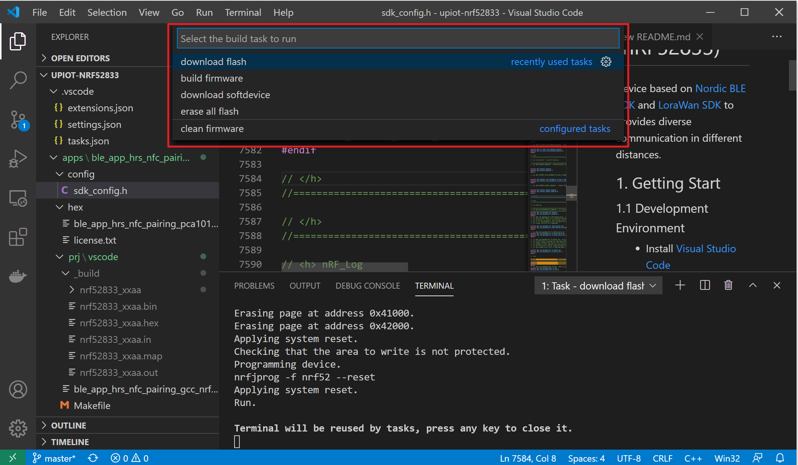
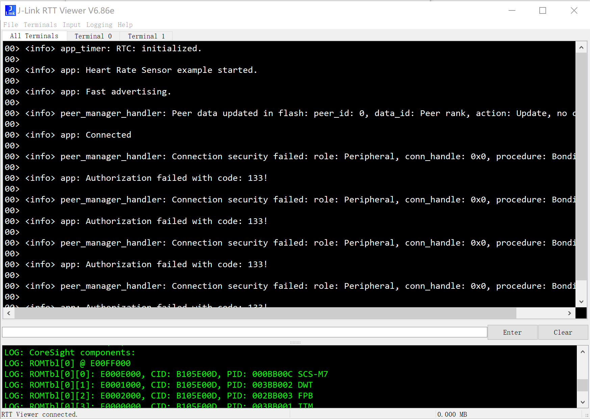

# UpIoT Device Node (nRF52833)

Device based on [Nordic BLE SDK](./sdk/nrf) and [LoraWan SDK](./sdk/LoRaMac) to provides diverse communication in different distances.

| SDK Name | Upstream Version | Local Path |
| -------- | ---------------- | ---------- |
| Nordic BLE Stack | nRF5_SDK_17.0.2_d674dde | [sdk/nrf](./sdk/nrf) |
| LoRaWan | [b7e170c](https://github.com/Lora-net/LoRaMac-node/commit/b7e170c9036dbbf05b3a27d4364dd9576793d840)(2020/11/16) | [sdk/LoRaMac](./sdk/LoRaMac) |

## 1 Hardware Kit

---

## 2. Getting Start

----

### 2.1 Set Development Environment

- Install [Visual Studio Code](https://code.visualstudio.com/download)
- Install plugins at [.vscode/extensions.json](.vscode/extensions.json) automatically or by manual from Visual Studio Marketplace:
    - [GNU Arm embedded toolchain for Windows](https://marketplace.visualstudio.com/items?itemName=metalcode-eu.windows-arm-none-eabi), and set binary path to environment variable for examle `C:\Users\bluew\.vscode\extensions\metalcode-eu.windows-arm-none-eabi-0.1.6\arm-none-eabi\bin` (_Note: please use your path with your account name._)
    - [Cortex-Debug](https://marketplace.visualstudio.com/items?itemName=marus25.cortex-debug)
- [J-Link Software and Documentation pack](https://www.segger.com/downloads/jlink/#J-LinkSoftwareAndDocumentationPack)
- [nRF5x-Command-Line-Tools](https://www.nordicsemi.com/eng/nordic/Products/nRF52840/nRF5x-Command-Line-Tools-Win32/58850), and set binary path to environmetn variable for example `C:\Program Files (x86)\Nordic Semiconductor\nrf-command-line-tools\bin` (_Note: please use your path with your account name._)
- Download Latest [GNU Arm Embedded Toolchain](https://developer.arm.com/tools-and-software/open-source-software/developer-tools/gnu-toolchain/gnu-rm/downloads), extract and copy to the folder of vscode plugin - "GNU Arm embedded toolchain", for example `C:\Users\bluew\.vscode\extensions\metalcode-eu.windows-arm-none-eabi-0.1.6\arm-none-eabi\bin` (_Note: please use your path with your account name._)

### 2.2 Launch Tasks: Build and Flash

All tasks are put into [.vscode/tasks.json](.vscode/tasks.json) file include build/clean firmware, download softdevice/flash etc.

- In vscode IDE, press "ctrl + shift + B" to launch task list as follows:

- Select a task such as "build firmware".
- Select an app name like "ble_app_hrs_nfc_pairing".

_NOTE: All apps are put at folder [apps](apps)_

_NOTE: Normally, you need build firmware->erase firmware->download softdevice->download flash._

### 2.3 View log from Jlink RTTViewer

- Set `NRF_LOG_BACKEND_RTT_ENABLED` to 1 at <apps>/<app>/config/sdk_config.h
- Rebuild application, and download flash
- Launch "JLink RTT Viewer", and select the target to "nRF52833_xxAA"

## 3 Reference

---

- [nRF52833 User Guide](https://infocenter.nordicsemi.com/index.jsp?topic=%2Fstruct_nrf52%2Fstruct%2Fnrf52833.html&cp=3_1)
- [nRF52833 Tools](https://infocenter.nordicsemi.com/index.jsp?topic=%2Fug_nrf52833_dk%2FUG%2Fnrf52833_DK%2FnRF52833_nordic_tools.html)
- [HMAA turtorial](https://github.com/lukejin-dev/HMAA/blob/master/doc/%E5%A6%82%E4%BD%95%E4%BD%BF%E7%94%A8Vscode%E5%BC%80%E5%8F%91%E8%B0%83%E8%AF%95nRF52832.md)